<div align="center">
  
</div>

<div align="center">
  
</div>

<p align="center">
  
  &nbsp;
  
</p>

<br/>


<br/>



I'm a full-stack engineer from **IIIT Gwalior** who gravitates toward the parts of software most people avoid: network protocols, desktop internals, and infrastructure that has to stay up.

Right now I'm contributing to **GNOME** (Control Center and Network Displays' RTSP stack) and building cloud tooling the rest of the time.

```yaml
name: "Prashant Kumar"
based_in: "India"
role: "Full Stack Developer"
education: "B.Tech + M.Tech (IDD), IIIT Gwalior"
current_focus:
  - "GNOME Control Center"
  - "GNOME Network Displays (RTSP)"
interests:
  - "Open Source"
  - "Cloud & Networking"
  - "Competitive Programming"
```

<br clear="right"/>

<p align="center">
  
</p>


<br/>
<br/>


<p>
  <samp>LANGUAGES</samp>
  <br/><br/>
  
  
  
</p>

<p>
  <samp>BACKEND</samp>
  <br/><br/>
  
  
  
  
</p>

<p>
  <samp>FRONTEND</samp>
  <br/><br/>
  
  
</p>

<p>
  <samp>CLOUD</samp>
  <br/><br/>
  
  
  
</p>

<p>
  <samp>AI / ML</samp>
  <br/><br/>
  
  
  
  
  
</p>

<p>
  <samp>DEVOPS</samp>
  <br/><br/>
  
  
  
  
</p>

<p>
  <samp>DATABASES</samp>
  <br/><br/>
  
  
  
  
</p>

<br clear="right"/>

<p align="center">
  
</p>


<br/>
<br/>

<p align="center">
  
</p>

<div align="center">
  
  
</div>

<br/>

<div align="center">
  
</div>

<br/>

<div align="center">
  
</div>

<p align="center">
  
</p>


<br/>
<br/>

<p align="center">
  Whether it's open source, an interesting systems problem, or just a good conversation,<br/>
  my inbox is open.
</p>

<p align="center">
  <a href="mailto:iampkumar02@gmail.com">
    
  </a>
  &nbsp;
  <a href="https://algo-voyager.vercel.app/" target="_blank">
    
  </a>
  &nbsp;
  <a href="https://www.linkedin.com/in/iampkumar" target="_blank">
    
  </a>
  &nbsp;
  <a href="https://github.com/Algo-Voyager" target="_blank">
    
  </a>
</p>

<br/>

<div align="center">
  
</div>
